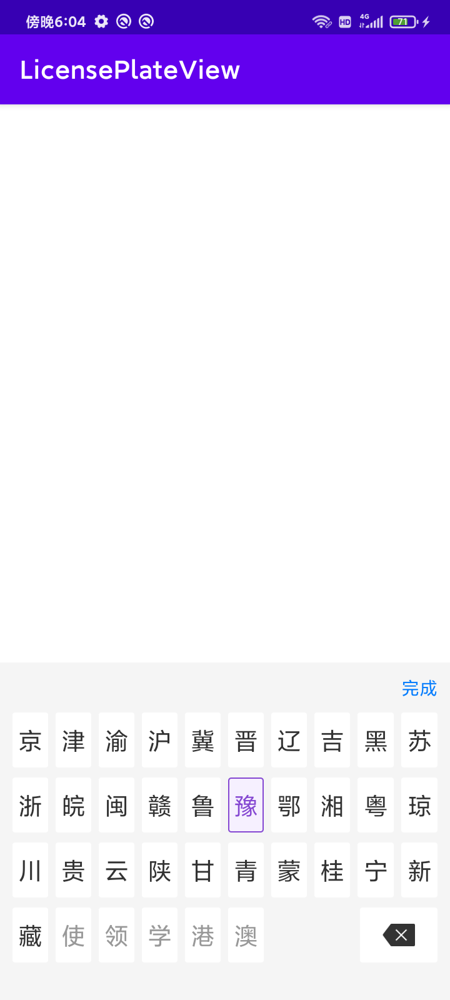

# LicensePlateView
一个超级简单的自定义各省份简称键盘，多种属性配置，可实现多种效果。

## 效果展示



## 快速开始

1、在你的根项目下的build.gradle文件下，引入maven。

```groovy
allprojects {
    repositories {
        maven { url "https://gitee.com/AbnerAndroid/almighty/raw/master" }
    }
}
```
2、在你需要使用的Module中build.gradle文件下，引入依赖。

```groovy
dependencies {
    implementation 'com.vip:plate:1.0.0'
}
```
3、XML引入即可

```xml
     <com.vip.plate.LicensePlateView
        android:id="@+id/lp_view"
        android:layout_width="match_parent"
        android:layout_height="wrap_content"
        app:layout_constraintBottom_toBottomOf="parent"
        app:lp_complete_text_size="14sp"
        app:lp_margin_left_right="10dp"
        app:lp_rect_spacing="6dp"
        app:lp_rect_text_size="19sp"
        app:lp_text_click_effect="true" />

```

4、属性介绍

| 属性                        | 类型        | 概述                            |
| ------------------------- | --------- | ----------------------------- |
| lp_background             | color     | 整体的背景颜色                       |
| lp_rect_spacing           | dimension | 格子的边距                         |
| lp_rect_height            | dimension | 格子的高度                         |
| lp_rect_margin_top        | dimension | 格子的距离上边                       |
| lp_margin_left_right      | dimension | 左右距离                          |
| lp_margin_top             | dimension | 上边距离                          |
| lp_margin_bottom          | dimension | 下边距离                          |
| lp_rect_background        | reference | 格子的背景                         |
| lp_rect_select_background | reference | 格子选择后的背景                      |
| lp_rect_text_size         | dimension | 格子的文字大小                       |
| lp_rect_text_color        | color     | 格子的文字颜色                       |
| lp_rect_select_text_color | color     | 格子的文字选中颜色                     |
| lp_is_show_complete       | boolean   | 是否显示完成按钮                      |
| lp_complete_text_size     | dimension | 完成按钮文字大小                      |
| lp_complete_text_color    | color     | 完成按钮文字颜色                      |
| lp_complete_text          | string    | 完成按钮文字内容                      |
| lp_complete_margin_top    | dimension | 完成按钮距离上边                      |
| lp_complete_margin_bottom | dimension | 完成按钮距离下边                      |
| lp_complete_margin_right  | dimension | 完成按钮距离右边                      |
| lp_text_click_effect      | boolean   | 是否触发点击效果，true点击后背景消失，false不消失 |

5、方法介绍

| 方法 | 参数 | 概述                 |
|  ----  |----|--------------------|
| keyboardContent | 回调函数 | 获取点击的省份简称简称信息      |
| keyboardDelete | 函数 | 删除省份简称简称信息         |
| keyboardComplete | 回调函数 | 键盘点击完成             |
| openProhibit | 函数 | 打开禁止（使领学港澳），使其可以点击 |


## 文章介绍

[一个简单的自定义输入框](https://juejin.cn/post/7216143702125166653)

## 欢迎关注作者

微信搜索【Android干货铺】，或扫描下面二维码关注，查阅更多技术文章！


## License

```
Copyright (C) AbnerMing, LicensePlateView Open Source Project

Licensed under the Apache License, Version 2.0 (the "License");
you may not use this file except in compliance with the License.
You may obtain a copy of the License at

     http://www.apache.org/licenses/LICENSE-2.0

Unless required by applicable law or agreed to in writing, software
distributed under the License is distributed on an "AS IS" BASIS,
WITHOUT WARRANTIES OR CONDITIONS OF ANY KIND, either express or implied.
See the License for the specific language governing permissions and
limitations under the License.
```

